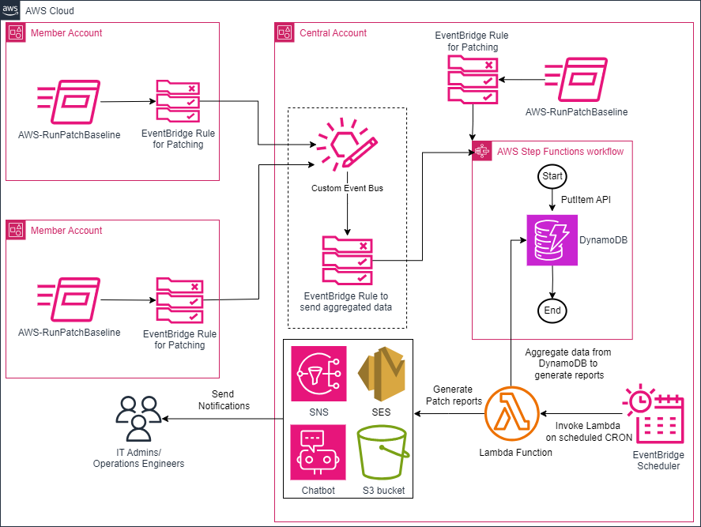

# Automate Systems Manager patching reports via email and slack notifications in an AWS Organization

This repo hosts CloudFormation templates related to the AWS Cloud Operations blog post:

[**Automate Systems Manager patching reports via email and slack notifications in an AWS Organization**](https://aws.amazon.com/blogs/mt/automate-systems-manager-patching-reports-via-email-and-slack-notifications-in-an-aws-organization/)

For details on how to use the corresponding CloudFormation templates, refer to the blog post.

## Solution Diagram

## CloudFormation Templates:

### Central Account Template:
  * [PatchingReport_Central.yaml](/Templates/CloudFormation/PatchingReport_Central.yaml) or
  * [PatchingReport_Central_MultipleSchedules.yaml](/Templates/CloudFormation/PatchingReport_Central_MultipleSchedules.yaml) (supports multiple schedules - cron or rate)

  **Note:** For the Central account template, Stack name must not exceed 29 characters due to resource naming restrictions.

### Member Account Template:
  * [PatchingReport_Member.yaml](/Templates/CloudFormation/PatchingReport_Member.yaml)

### Single Account Template:
  * [PatchingReport_Single.yaml](/Templates/CloudFormation/PatchingReport_Single.yaml) or
  * [PatchingReport_Single_MultipleSchedules.yaml](/Templates/CloudFormation/PatchingReport_Single_MultipleSchedules.yaml) (supports multiple schedules - cron or rate)

## Usage

Choose the appropriate template based on your AWS Organization setup and scheduling requirements:
- For multi-account setups, use the Central and Member templates
- For single-account setups, use the Single template

If you need to generate reports using multiple schedules, you can configure multiple cron and rate expressions using the template with multiple schedules.

## Security

See [CONTRIBUTING](CONTRIBUTING.md#security-issue-notifications) for more information.

## License

This library is licensed under the MIT-0 License. See the LICENSE file.
